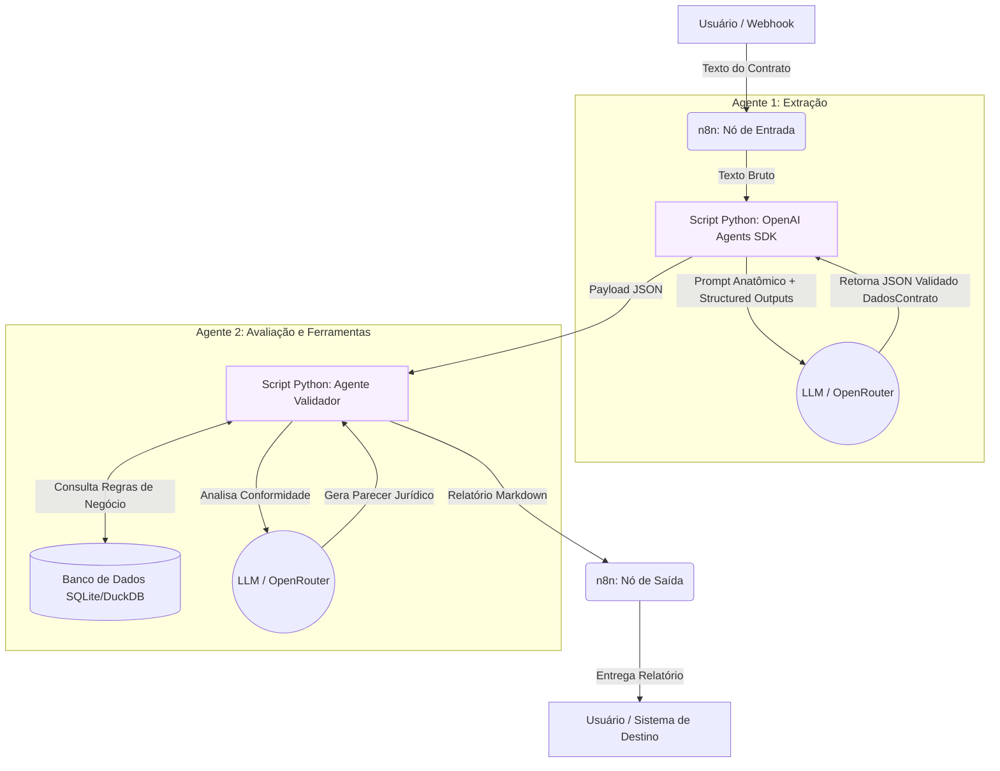

# Especificação do Projeto: Sistema Multi-Agente de Análise de Contratos

---

## 1. Descrição do Problema

A auditoria e extração manual de metadados em contratos de prestação de serviços é um processo moroso, custoso e propenso a erros humanos. Divergências no cadastramento de CNPJs, valores totais, prazos de vigência ou percentuais de multa rescisória geram prejuízos financeiros e riscos jurídicos.

O objetivo deste projeto é construir um **Sistema Multi-Agente Automatizado** onde o **Agente 1 (Extração)** lê o texto bruto do contrato, extrai os metadados em JSON validado via Pydantic (`DadosContrato`), e os disponibiliza para o **Agente 2 (Validação)** realizar auditorias contra regras de negócio em banco de dados local.

---

## 2. Arquitetura Inicial do Sistema

O sistema conecta o **n8n** para orquestração de webhooks ao **OpenAI Agents SDK** em Python.

---

## 3. Componentes da Solução

- **Orquestração**: n8n
- **Agentes Python**: OpenAI Agents SDK (`Agent`, `Runner`)
- **Validação de Saída**: Pydantic v2 (`output_type=DadosContrato`)
- **Conectividade de LLM**: OpenRouter API (`OpenAIChatCompletionsModel`)
